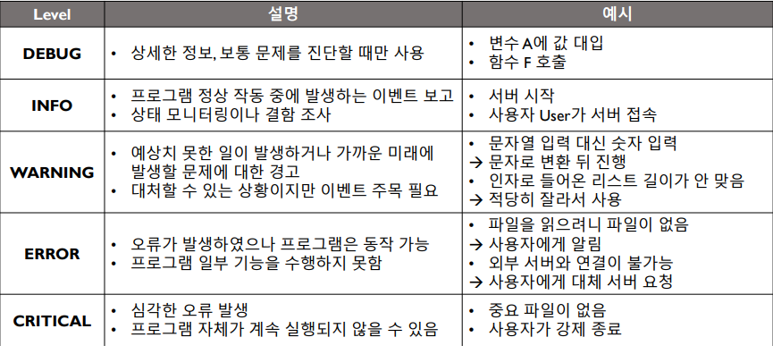

# Python(파이썬)

## Overview
1989년 크리스마스에 연구실이 닫혀있어 심심해서 프로그래밍 언어를 만듦. 영국 코미디 그룹 몬티 파이썬에서 이름을 땀.

## Features of Python
- 플랫폼 독립적인 인터프리터 언어
: 코드와 인터프리터만 있으면 윈도우, 안드로이드, ios등 어디에 있던 실행 가능.
- 완전 객체 지향 언어
: 모든 것이 객체이다.
- 동적 타이핑 언어
: 코드를 실행하던 중에 타이핑하며, 덕 타이핑 기능에 따라 타이핑함(?)

- 쉬운 문법 & 다양한 기능 -> 높은 생산성
- 다양한 라이브러리
    - 쉬운 라이브러리 설치 및 관리
    - 수많은 사람들이 다양한 라이브러리에 기여 및 공개
- 널리 쓰임 -> 구글링으로 대부분의 문제를 해결 가능.

> Jupyter Notebook
: 파이썬의 기본 실행 환경은 Interactive Shell 이지만, 일반적으로 .py파일로 실행하기 때문에 Interactive 하지 않다. 이를 살리기 위한 Ipython 커널을 기반으로한 Interactive 파이썬 셀 프로그래밍이다.

## 변수(Variable)
: 값을 저장하는 공간 = 연산자로 대입 연산

### 파이썬 변수의 특징
- 모든 변수는 메모리 주소를 가르킴(모든 것은 포인터)
- 변수명 <- 일종의 이름표
    - 선언한 변수에 특정 공간이 생기는 개념이 아님.
    - 필요하면 공간을 만들고 변수명을 붙이는 격.
- 알파벳, 숫자, 언더스코어로 선언.
- 변수명은 가독성을 중요시하고 대소문자가 구분된다.
- 변수명으로 쓸 수 없는 예약어가 존재함.
- C와 달리 대입연산이 딱히 반환값을 가지지 않음.
- 연속해서 대입 가능.(뒤에서 부터 대입)
- (:= 연산으로 대입과 동시에 반환 가능)
### 원시 자료형(Primitive Data Type)
: 가장 기본이 되는 자료형
- int, float, complex
- String, bool, None

__불변타입(Immutable Type)이다.__
- 불변타입들은 저장된 값이 변하지 않는다.
- 물리적 메모리 주소를 가르침.
- 원시 자료형과 Tuple을 제외한 다른 모든 파이썬 객체는 모두 가변타입이다.(Mutable Type)

```
>>> a = 10
>>> b = a
>>> a += 1
>>> a, b, a is b
(11, 10, False)

>>> a = [1,2,3]
>>> b = a
>>> a += [4]
>>> a, b ,a is b
([1,2,3,4], [1,2,3,4], True)

>>> a = a + [5]
>>> a, b, a is b
([1,2,3,4,5], [1,2,3,4], False)
```
- 파이썬에서는 적당한 크기의 원시 자료형 대입은 기존 객체를 할당
```
>>> a = 1   #INT는 255를 기준.
>>> b = 1
>>> a is b
True

>>> a = 12345
>>> b = 12345
>>> a is b
False

>>> a = 'text'
>>> b = 'long-long-text'
>>> a is 'text', a=='text', b is 'long-long-text', b == 'long-long-text'
True, True, False, True

a = True
a is True

a = None
a is None # 더 Conventional한 방식
```

__산술연산자()__
- +, -, *, **, /, //, %

__비트연산자(Bit Operators)__
- NOT ~ -> 비트 부정
- OR |  -> 비트 합
- AND & -> 비트 곱
- XOR ^ -> 배타적 비트합
- SHIFT >> << -> 비트 시프트

In-place vs Out-place
```
a += 1
a = a + 1
```

__비교연산자(Condition Operators)__
- <, >, ==, <=, >=
- == : 값이 같다. is : 주소가 같다. != : 값이 다르다. is not 주소가 다르다.
- in : 포함된다. not in : 포함되지 않음.

bool 끼리의 연산을 위해서 논리 연산자를 활용.
- not : 부정
- or : 논리합
- and : 논리곱

python은 비교연산을 한번에 평가하기 때문에 `2 < a < 4` 같은 표현이가능하다.

### Dynamic Typing
: 코드 실행 지점에서 데이터의 타입을 결정함. 따로 데이터 타입을 명시하지 않아도 됨.

__Implicit Type Conversion__
- bool -> int -> float -> complex
- None과 String은 별개
- int 간의 나누기는 float

__Explicit Type Conversion__
:`[Type]([value])`로 명시적 형 변환 가능. Initializer라고 생각하면 좋을 듯.
- int(a), float(text), str(value)
- 적절한 text는 적절한 값으로 변형.
- 실수 -> 정수 : 내림.
    - round : 반올림
- 빈 문자열, 0, None은 False로 변환

__Type Checking__
- type 함수로 변수의 타입 확인 가능
- isinstance 함수로 변수가 지정 타입인지 확인
    - `isinstance([variable], [type])`

## Data Structure

배열 : 일련의 데이터를 하나로 묶음.

List indexing & Sliding

- `seq[index]`형태로 요소 하나 접근
- 0부터 숫자세기 시작
- 음수 가능

- `seq[start:end:step]` 형태로 List 자르기

파이썬에서 제공되는 기능은 일반적으로 `예약어`, `내장함수`, `메소드`의 형태를 지닌다.
예약어 -> 문법
내장함수 -> General Class
메소드 -> 특정 Class

## Conditional & Loop

### Condition
: 특정 조건이 만족될 경우 실행할 문항을 설정. 들여쓰기와 :으로 구문을 구분.


## Function

- global : 최상위 변수 사용 선언
- nonlocal : 직상위 변수 사용 선언

### variable capture
- 몇몇 다른 프로그래밍 언어에서, 함수 안의 지역 변수들은 그 함수가 처리되는 동안에만 존재하게 되는데, Python, js의 경우 함수를 리턴하고, 리턴하는 함수가 closure를 형성하여 variable을 capture할 수 있는 것이다.

```
def print_closure_factory(number):
    def print_closure():
        print(number)

    return print_closure

print_5 = print_closure_factory(5)
print_10 = print_closure_factory(10)

number += 10
print_5() -> 5
print_10() -> 10
```

- 파이썬에서 Closure는 Factory 형식으로 사용.
- 파이썬에서는 함수도 일반 객체(일급 객체)이다.
    - 변수로 할당 가능 -> Argument & Return 가능.

__Closure Example__
```
def add(var):
    return var + 2
def multiply(var):
    return var * 2

def factory(function, n):
    def closure(var):
        for _ in range(n):
            var = function(var)
        return var
    return closure

print(factory(add, 4)(10)) -> 18
print(factory(multiply, 4)(3)) -> 48
```

### Decolator
- 함수 하나를 인자로 받아 같은 형태의 함수를 반환하는 함수. 
- @을 사용하여 함수를 꾸미는데 사용 가능
- Class를 사용할 시 Decorator에 인자 추가로 가능.
- Decolator에 인자를 넣고 싶은 경우에는 새로운 factory를 추가하면 된다.(한번 더 wrapping) 필요.
- 함수를 Wrapping하기 때문에 기존 함수에 접근 불가
    - Docstring 함수 이름 등 기존 함수의 특성을 가져올 필요가 있음.
    - functools 라이브러리의 wraps 데코레이터 사용.
    - torch를 사용할 때 사용.

### 재귀함수
- 자기 자신을 호출하여 반복적으로 수행.
- 수학의 점화식과 동일
- 재귀함수와 반복문은 수학적으로 동치(서로 변환 가능)

### Variable Length Parameter in Function
- 인자 개수가 정해져 있지 않다면..?
- *(Asterisk)를 사용하여 남은 여러 인자를 Packing 가능. `a, *b, c = [1,2,3,4,5]`
- 가변 인자는 맨 마지막에 단 한 개만 위치 가능.
```
def add_all(a, b, *args):
    print(args) # (3,4,5)
    sum = 0
    for elem in args:
        sum += elem
    return a + b + sum

print(add_all(1,2,3,4,5))
```

### Keyword Variable Length Parameter
- 명시적으로 지정된 파라미터가 남는다면? -> 키워드 가변인자
- ** (Double asterisk)를 사용하여 남은 키워드 변수를 dict 형태로 packing

```
def print_args(a, *args, **kwargs):
    print(args, kwargs)

print(print_args(1, 2, 3, var1=100, var2=200))
```
- 파라미터 순서 : 일반 인자 -> 기본값 인자 -> 가변인자 -> 키워드 가변인자
```
def print_args(var1, var2=10, *args, **kwargs):
    print(var1, var2=10, args, kwargs)

print_args(1,2, 3, var3=10)
```

### Unpacking
- 리스트에, 튜플에 적용가능.
```
def function(a, b, c):
    print(a, b, c)
l = [1,2,3]
function(*l)
```
- Dictionary에 **을 붙이면 Keyword unpacking.
```
def function(var1, var2, **kwargs):
    print(var1, var2, kwargs)
d = {
    'var1' : 10,
    'var2' : 20,
    'var3' : 30,
}

function (**d)
```

### Type hints
- 파이썬은 동적 타이핑 이지만 다소 interface를 알기 어려움. 가독성의 큰 문제.
- 함수에 타입 흰트 제공이 가능. `[function]([var]:[type], ...)` 의 형태
```
def multiply_text(text:str, n: int)-> str:
    return text * n
```
- 그러나 딱히 타입을 안맞춰도 에러가 안 남. 사람을 위한 용도이다.

## Pythonic Programming
- 더 Python 스럽게 프로그래밍 하는 것이 중요.

### Comprehension
- List, Dictionary 등을 빠르게 만드는 기법.
    - for + append 보다 속도 빠름.
```
result = [i*2 for i in range(10)]
result = {str(i):i for i in range(10)}
result = {str(i) for i in range(10)}
```
- if 문을 마지막에 달아 원하는 요소만 추가 가능
```
evens = [i for i in range(100) if i % 2 == 0]
```
- 겹 for 문 사용 가능
```
result = [(i, j) for i in range(5) for j in range(i)]
```
- 다차원 배열 만들기가 유용.
```
eye = [[int(i==j) for j in range(5)] for i in range(5)]
```

### Generator
```
def my_range(stop):
    number = 0
    while number < stop:
        yield number
        number += 1

for i in my_range(5):
    print(i)
```
- range 함수의 경우 숫자를 하나씩 생성하여 반환
    - 이러한 요소를 하나씩 생성해서 반환하는 객체.
- function에 yield를 사용할 시 Generator가 됨.
- yield 하는 위치에서 값을 반환.
- 다시 값을 요청 받을 시 yield 다음 줄 부터 실행
- Return이나 마지막에 온 경우 반복을 멈춤.
- Sequence 전체를 생성하는 것이 아니므로 메모리 효율적.
    - 매우 큰 데이터 셋을 처리할 땐 Generator 사용 권장.
- 괄호로 Generator Comprehension 형태로 선언 가능.
    - Function 등으로 이미 괄호 쳐져 있다면 괄호 생략 가능.
```
even_generator = (i * 2 for i in range(100))
```

### Built-in Functions
- __sum__
- __any, all__ : 하나라도 참 / 모두 참
- __max, min__ : 가장 큰 값 / 가장 작은 값

__zip__
2개 이상의 순환 가능한 객체를 앞에서부터 한번에 접근할 때 사용.
    - tuple로 반환
    - zip에서 길이가 안맞는 부분은 버린다.
```
arr= [[1,2,3], [4,5,6], [7,8,9]]
for row in array:
    print(row)

for col in zip(*array): # 열단위 접근
    print(col)
```

> seq2 = zip(*seq1)의 역연산은 seq1 = zip(*seq2) 이다. Transpose 하는 것

__enumerate__
- For문이 Sequence를 돌 때 그 index가 필요한 때 사용.
- zip과 enumerate를 동시에 사용하는 등 여러 Generator를 한번에 사용.
```
seq1 = ['This', 'sentence']
seq2 = [True, False]

for i, (a, b) in enmerate(zip(seq1, seq2))
    print(i, a, b)
```
- Generator는 List 형태로 출력하기 위해선 list로 변환 필요.

__Lambda Function__
- 함수의 이름 없이 빠르게 만들어 쓸 수 있는 익명 함수.
- 수학에서의 람다 대수에서 유래.
```
def add(a,b):
    return a + b
-> 
add = lambda a, b: a+b
```
- 여러줄을 쓸 수 없음. 공식적으로는 lambda의 사용을 권장하지 않음, 그러나 많이 씀.
    - 문서화 지원 미비
    - 이름이 존재하지 않는 함수 생성
    - 복잡한 함수 lambda로 작성할 시 가독성 하락.

__map__
- 각 요소에 function 함수를 적용하여 반환

__filter__
- 각 요소에 function 함수를 적용하여 참이 나오는 것만 반환

# Object-Oriented Programming (객체 지향 프로그래밍)

### Procedure Programming(절차 지향 프로그래밍)
: 절차를 차례대로 작성하는 프로그래밍 방식.
- 중간의 코드를 수정한다면? -> 모든 코드의 수정이 필요할 수 있음.
- 협업을 한다면? 한 프로그래머의 수정 사항이 다른 프로그래머에게 큰 영향

## OOP
- 코드를 객체 단위로 나눌 필요를 느끼고 객체 단위 코드 수정 및 분업을 한 프로그래밍 방식.

__Class & Object__
: 각 종류(Class)당 객체(Object)가 하나만 존재하진 앟는다.
그러나 각 객체의 데이터(Attr)은 달라도 행동(Method)는 동일하다.
ex) 고객 - 조호준, 홍관진, 회사- 로진택배, 한진택배

__Class Declaration__
- 클래스 이름은 CamelCase가 관습적으로 사용됨.
    - snake_case -> attr, functions를 사용.
    - CamelCase -> class에 사용.
- 부모 클래스가 지정되지 않았을 시 object가 자동 상속

__Class Attribute__
```
class Courier(object):
    NATIONALITY = 'KOR'
```
- 클래스 전체가 공유하는 속성 값.
- 모든 객체(instance)가 같은 값을 참조. Like global variable
- 남용하면 스파게티 코드의 원인.
- `클래스.attribute` 형태로 접근 (`객체.attribute` 형태로도 가능)

__Class Method__
- 각 객체에 적용이 가능한 함수
- 현재 수정하고나 하는 객체를 self 로 지칭(관습적, this라고 지칭해도 무방)
    - C와 java에서의 this와 같음.
- Class.method(instance, args) 혹은 instance.method(args, ...)

__Class Attribute__
- 각각의 객체가 개인적으로 가지는 값
- instance.attr의 형태로 접근
- class 형태로 선언되어 나온 객체는 언제 어디서든 attribute 수정 가능
-> 그러나 나중에 추가한다면 생성자에서 None으로라도 선언해두는 것이 좋음.

__Magic Method:Initializer__
- 메소드 이름이 `"__METHOD__"` 형태일 경우 특별한 Method
1. 생성자(`__init__`)
    - 객체를 생성할 때 호출됨.
    - 일반적으로 객체의 속성을 초기화 하는데 사용.
    - Class 형태로 호출하여 객체 생성
    - 거의 유이하게 정해진 Argument format이 없는 Magic Method
2. 소멸자(`__del__`)
    - 객체를 소멸할 때 호출됨
    - 파이썬은 Garbage Collector로 메모리 관리
        - 객체가 어디에서도 참조되지 않을 때 객체가 소멸
        - 소멸 타이밍을 잡기 어려워 잘 사용되지 않음.
    - del 명령어
        - 변수 이름을 명시적으로 없애기 가능
        - `참조를 명시적으로 삭제하는 것`이지 객체를 명시적으로 삭제하는 것이 아님.

## Three Elements of OOP
- 상속
- 다형성
- 캡슐화
- 직렬화
### 상속(Inheritance)
: 기존에 구현틀 상속 -> 새로운 틀 제작
- 기존의 틀: 부모 Class, 새로운 틀 : 자식 Class
- 자식 Class에서는 부모의 기능을 이용 가능
- 같은 기능을 재작성할 필요가 없음.
```
class Courier(object):
예약어 클래스이름(부모클래스)
```
### 다형성 (Polymorphism)
: 같은 이름의 메소드를 다르게 작성
- 각 자식 클래스가 다른 클래스와 차별
- 부모 메소드로 접근시 자식 메소드 실행
- 외부에서는 똑같은 API로 접근
- 고객 입장에서는 코드 수정이 없음.

파이썬에서는 동적 타이핑
- 고객 입장에서는 클래스 구분 X -> 같은 이름의 메소드가 있으면 실행(Duck Typing)

> Python에서의 상속과 다형성
> - 다중 상속 지원 -> 죽음의 다이아몬드 초래.
> - super 내장 함수를 이용하여 상위 클래스 접근 가능.
> -> JAVA의 경우에는 interface만 다중상속 가능.

__Static & Class Method__
파이썬에는 2가지 정적 함수 존재
    - instance.method 형태로 접근 가능
    - 일반적으로 Class.method 형태로 사용.
- `Static Method`
    - staticmethod 꾸밈자 사용.
    - 특별한 argument를 받지 않음
    - 일반적으로 class내 유틸 함수로 사용
    - Class를 일종으 Namespace로 사용
- `Class Method` (Python )
    - Classmethod 꾸밈자 사용.
    - 호출된 class인 cls를 받음.
    - factory 패턴에서 사용.
```
class Number:
    Constant = 19

    @staticmethod
    def static_factory():
        obj = Number()
        obj.value = Number.Constant
        return obj
    
    @classmethod
    def class_factory(cls):
        obj = cls()
        obj.value = cls.Constant
        return obj

class Complex(Number):
    def sum():
        pass

print(Number.static_factory(), Number.class_factory()) # Number, Number
print(Complex.static_factory(), Complex.class_factory()) # Number, Complex
```
__-> 상속하면 차이가 발생__


### 가시성, 캡슐화(Visibility)
: 다른 클래스에게 객체의 내부를 감추기
- 캡슐화, 정보 은닉
- 클래스 간 간섭 최소화
- 최소한의 정보만을 지정된 API로 공개
- C나 Java에선 private & protected로 구현

__Python에서의 가시성__
- 명시적인 private & protected 범위가 없음 -> 모두 public
- private 변수/함수 이름 앞에 __를 붙임 (밑줄 2개) -> 관습적
- protected 변수/함수 이름 앞에 _를 붙임 (밑줄 1개) -> 관습적
- "__"의 경우 변수명 앞에 Class 이름을 넣어 Mangling을 진행 - 자식과 이름이 안 겹침.
- private와 protected는 vscode 등의 코드 완성에서는 안보임.
- 굳이 구분하는 이유 -> 가독성 때문 (API를 이용하는 사람에게 알려주기 용)

__Property__
- get과 set을 정의하기위해 get과 set을 붙이는 방식이 Pythonic 하지 못함.
- Property를 통해 Getter, Setter를 명시적 설정 가능
- Encapsulation 등에 활용. 

### Magic Methods

__indexing 메소드__
- `__getitem__`, `__setitem__` 로 [] indexing을 재정의
ex) Numpy, Pandas 등


__Length 메소드__
- `__len__`

__Typing__
- 객체를 다른 타입으로 형 변환할 때 호출.
- `__str__`, `__int__`, `__float__`, `__bool__` 등이 존재

__Comparison Operator__
- A < B를 호출 -> A.__lt__(B)를 호출
- 이외에도 `__le__`, `__gt__`, `__ge__`, `__eq__`, `__ne__` 가 존재

__Arithmetic Operator__
- `__add__`, `__sub__`, `__mul__` 등이 존재 -> Out-place
- In-place 버전인 `__iadd__`가 존재(이 경우 self를 직접 수정 필요)

__Callable__
- 생성된 객체를 함수처럼 호출 가능하게 만듦.
- `instance(args, ...)`가 `instance.__call__`을 호출

__Iterable__
```
seq = [1,2,3,4,5]

iterator = iter(seq)
while True:
    try:
        elem = next(iterator)
    except StopIteration:
        break
    print(elem)
```
- iter 내장함수 : 해당 객체의 순환자를 반환. `__iter__`
- next 내장함수 : 해당순환자를 진행. `__next__`
- Generator는 자동으로 `__iter__`와 `__next__`가 구현

__Context Manager__
- 소멸자 대용으로 특정 Block 입장/종료 시 자동으로 호출
- File description등을 자동으로 닫고자 할 때 사용.
- 코딩할 일은 없으나 with 구문을 사용하는 일은 많음.

## Module & Package
- 다른 사람이 완성한 함수와 클래스를 사용하기 위함.
- 내장 & 외부 라이브러리 사용

__Import__
- 파이썬에선 모듈 == .py파일
- import 구문을 사용하여 모듈을 불러옴.
    - 해당 파일 최상위에 선언된 모듈의 요소들을 불러오기 가능.
    - module.element 식으로 사용.
- . 혹은 ..없이는 절대 경로 기준(Python이 실행되는 곳)
- import 문은 import 된 .py파일을 처음부터 끝까지 실행시킨다.
- 만약 해당 모듈을 main으로 했을 때 특정 Block을 실행시키고 싶다면?
    - `__name__` 기본 변수를 `"__main__"`으로 설정
    - `__name__` 기본 변수는 현재 모듈의 이름을 보여줌.
```
import directory.functions
print(directory.functions.add(1, 2))

import directory.functions as func
print(func.add(1,2))

from directory import functions
print(functions.add(1,2))

from directory.functions import add
print(add(1,2))

from directory.functions import * 
print(add(1, CONSTANT))                 # 권장하지 않음
```

- 최상위에선 상대경로가 작동되지 않음.
    - 최상위를 거치는 경우 포함
    - 일반적으로 프로젝트 이름으로 폴더를 만들어 코드를 넣음.
    - 부모 폴더 접근을 위해서는 모듈 형태로 실행 필요. `python -m test_nlp.dir1.sub_main`

- 파이썬은 강력하고 다양한 표준 라이브러리를 가지고 있음.
- 파이썬은 GIL 때문에 사실상 싱글 쓰레드

> GIL이란?
Global Interpreter Lock의 약자로 파이썬 인터프리터가 한 스레드만 하나의 바이트 코드를 실행 시킬 수 있도록 해주는 Lock. 하나의 스레드에 모든 자원을 허락하고 그 후에는 Lock을 걸어 다른 스레드는 실행할 수 없게 막아버린다.
python은 garbage collection과 reference counting을 통해 할당된 메모리를 관리하는데, 모든 객체는 reference count인 해당 변수가 참조된 수를 저장한다. 멀티스레드인 경우 여러 스레드가 하나의 객체를 사용한다면 reference count의 동기화 문제가 발생하기 때문에 GIL을 통해서 이러한 비효율을 방지한 것.
[참조](https://ssungkang.tistory.com/entry/python-GIL-Global-interpreter-Lock%EC%9D%80-%EB%AC%B4%EC%97%87%EC%9D%BC%EA%B9%8C)

### 만약 파이썬 표준 라이브러리로 해결할 수 없다면?
- 인터넷 상의 오픈 소스 라이브러리 설치 필요
- 수치 그래프 그리기 -> matplotlib
- 웹 서버 만들기 -> flask
- GPU 연산 사용하기 -> cupy
- 딥러닝 전용 라이브러리 -> tensorflow & pytorch

### 웹 서버 프로젝트와 딥러닝 프로젝트가 따로 있다면?
- 한 파이썬 위에 둘 다 설치한다 -> 관리가 어려움.
- 각각 다른 환경 & 파이썬에서 돌리고 싶은데...
-> 패키지 관리자가 필요.

## Advanced DataStructure

### Stack
: 선입후출(FILO)방식의 자료구조. List를 사용. 동적배열이기 때문에 push와 pop이 O(1)

### Queue
: 선입선출(FIFO)방식의 자료구조. List는 한쪽 방향만 열려있는 동적 배열이기 때문에 처음위치 삽입 혹은 삭제가 O(N)이 걸림. 중간 참조가 오래걸리나 큐 구조에선 필요 없음 -> collection Library에 deque를 사용. (이중 연결 리스트로 구현됨.)

### Priority Queue (heap)
: 최소 / 최대값을 빠르게 구하기 위한 자료구조
- min/max 함수 사용 -> O(N)
- 이진 검색을 위해선 내부 정렬이 필요.
- 입력할 때마다 sorted 사용 -> O(N log N)
- 리스트 정렬 후 값을 중간에 삽입/삭제 -> O(N)
-> 파이썬에서는 heapq Library의 heapq를 사용.
- heap push, O(log N)
- heap pop, O(log N)

### Defaultdict
: Dictionary의 기본 값을 지정 가능. 생성자를 받으면 됨. ex) lambda : 2 , int()

### Counter
: 값을 세는데 최적화된 데이터 구조. dictionary 처럼 생성 및 관리가 가능.
, 집합 연산 지원(횟수 더하기, 교집합, 합집합, 차집합)

### Named Tuple
: 데이터만을 담기 위한 클래스를 사용하는 경우가 있음. 숫자로 Indexing이 불가능. 튜플로 관리하는 경우에는 Attribute명으로 접근이 불가능
-> Named Tuple : 각 튜플 원소에 이름 붙이기가 가능하고 Unpacking 가능

```
from collections import namedtuple

Coords3D = namedtuple("Coords3D", ["x", "y", "z"])

point = Coords3D(10, 20, z=30)
print(point.x)
print(point[1])
print(*point)

point[1] += 1 # Error 튜플이기 때문에 데이터를 변경할 수 없음.?
```

### Dataclass
: Pythonic한 데이터 클래스를 위해서 dataclasses의 dataclass 데코레이터 활용.
## I/O
### Standard Input & Output
- print(args, sep=" ", end="\n)
- input() -> str
    -> 따로 Redirection이 없으면 콘솔 입/출력

### File

__File Open__
: 파이썬은 File Descriptor를 열기 위하여 open 내장 함수 사용.

```
fd = open("<파일이름>", "<접근 모드>", encoding="utf8")

fd.close() # 명시적으로 close 해주어야함.
```

```
with open("text.txt", "r") as fd: # with 구문은 자동으로 닫아줌.
    contents = fd.read()

print(contents)
```

### Directory
- os 라이브러리로 플랫폼 독립적인 폴더 생성 가능
  - 파이썬에선 Windows, Unix 모두 "/"로 폴더를 나타냄
- path 라이브러리로 경로 관련 연산 가능

```
# 하위 폴더 한번에 만들기, exist_ok 옵션으로 이미 있으면 무시할지 확인
os.makedirs("test/a/b/c", exist_ok=True)
```

__Listing Directory__
- listdir 함수로 폴더 내 파일/하위 폴더 검색
- glob 라이브러리로 유닉스 스타일 경로명 패턴 확장 적용.

### Pickle - 권장 X
- 파이썬 객체를 그대로 저장하고 싶을 때 객체를 직렬화 하여 파일로 저장.
- 장점 : 쓰기 쉽고, 파이썬 개체를 그대로 저장
- 단점 : 파이썬에서만 읽을 수 있으며, 보안 문제가 있다. -> 신뢰할 수 있는 개체만 불러올 것. 

__Class Pickling__
- Class 객체를 직렬화하기 위해선 해당 클래스가 직렬화 가능이 필요.
  - 모든 속성이 직렬화 가능 필요.
- 저장된 객체 pickle을 로드하고 싶으면 미리 해당 클래스 선언 필요
  - 해당 클래스 정보가 없다면 역직렬화 불가능.

### CSV (Comma Seperate Values)
- 표 데이터를 프로그램에 상관없이 쓰기 위한 데이터 형식
  - 필드를 쉼표(,)로 구분한 텍스트 파일
  - 탭(TSV), 공백(SSV) 등으로 구분하기도 함.
  - 통칭하여 Character Separated Values(CSV)라 지칭.
- Readlines로 읽을 수 있으나 <- 구현이 귀찮음.
> 데이터 안에 ,가 들어간 경우 "," 따옴표 안에 존재하는지 확인하고 파싱해야 함.

__csv Library__
```
import csv

with open('test.csv', 'r') as fd:
    reader = csv.reader(fd, 
        delimiter = ',',
        quetechar = '"',
        quoting = csv.QUOTE_MINIMAL
    )

    for entry in reader:
        print(entry)
```

```
import csv

with open('test.csv', 'w') as fd:
    wirter = csv.writer(fd,
        delimiter = ',',
        quetechar = '"',
        quoting = csv.QUOTE_MINIMAL
    )

    writer.writerow(['id', 'label'])
    writer.writerows([i, f'label_{i}'] for i in range(10))
```

### JavaScript Object Notation (JSON)
- 웹 언어인 Javascript의 데이터 객체 표현 방식
  - 자료 구조 양식을 문자열로 표현
  - 간겷하게 표현되어 사람과 컴퓨터 모두 읽기 편함
  - 코드에서 불러오기 쉽고 파일 크기 역시 작은 편
-> 그럼에도 Parser 직접 작성은 매우 귀찮음

__json Library__
```
import json

with open('test.json', 'r') as fd:
    data = json.load(fd)

data['hobbies][2]

```

```
import json

obj = {
    "ID" : None, 
    "bool": False,
    "hobbies" : {
        "sports" : [
            "snowboard", "volley-ball"
        ]
    }
}

with open('test.json', 'w') as fd:
    json.dump(obj, fd)
```

### eXtensible Markup Language (XML)
- 데이터 구조와 의미를 설명하는 태그를 활용한 언어
- <태그> 와 </태그> 사이에 값이 표시
- HTML은 웹 페이지 표시를 위한 XML
- 정규표현식으로 parsing 가능
- 파이썬 기본 XML Parser는 다소 불편하기 때문에 일반적으로 Beautiful Soup을 사용

### Yaml Ain't Markup Language (YAML)
- E-mail 양식에서 개념을 얻은 데이터 직렬화 양식
  - 들여쓰기로 구조체를 구분
  - [Key:Value] 형식의 해시 및 [-item] 형식의 리스트 사용
  - 공백 없는 텍스트는 따옴표 없이 사용가능
  - .yaml 혹은 .yml 확장자
- Python에서는 pyyaml 라이브러리를 사용

## Setting & Exceptions & Logging

### Programming Setting
프로그램의 설정 값을 만들어 주고 싶다면?
- 실행할 때마다 필요한 설정 값
  - 딥러닝 학습 횟수(Epoch), 학습 계수(Learning rate)
  - 사용하는 GPU 개수
    -> Command Line Argumet(명령행 인자)로 입력

- 한번 설정하면 수정을 잘 안 하는 설정 값
  - 학습 자료 폴더 위치
  - 웹 서버의 Listening Port
    -> 설정 파일에서 불러들이기(txt, YAML, ConfigParser)

__Command Line Argument__
- Console 창에서 프로그램 실행 시 프로그램에 넘겨주는 인자 값
- Command-line Interface(CLI)에서 흔히 쓰이는 방식
- 파이썬에서 sys 라이브러리의 argv 속성으로 접근
  - 공백 기준으로 잘라져 문자열 형태로 입력

__argparser Library__
- 인자 flag를 설정 가능하여 flag별 입력 가능 (긴 flat, 짧은 flag 활용)
- 기본값 설정 가능
- Type 설정 가능(문자열에서 변환)
- Help 제공하여 사용자 편의 향상
- 이 외 명령 줄 인자와 관련된 여러 도구 포함

### Exception Handling
- 프로그램 실행 중에는 다양한 예외/에러가 발생
- 예외가 발생할 경우 대응 조치가 필요
  - 불러올 파일이 없는 경우 -> 파일이 없음을 사용자에게 알림
  - 서버와 연결이 끊김 -> 다른 서버로 Redirection
- 예외가 발생할 수 있는 코드 -> (특정 예외 발생시) 대응코드 -> 계속 진행
```
try : 
    <예외 발생 가능 코드>
except <예외 클래스>:
    <대응 코드>
```
|예외 이름|설명|발생 가능 예시|
|---|---|---|
|IndexError|List의 Index 범위를 넘어감|list[101]|
|NameError|존재하지 않는 변수를 호출|not_exist +1|
|ZeroDivisionError|0으로 숫자를 나눔|10 / 0|
|ValueError|변환할 수 없는 문자열/숫자를 변환|float("abc")|
|FileNotFoundError|존재하지 않는 파일 호출|open("not_exist.txt","r)|
- 이 외에도 많은 내장 예외 존재

- 파이썬 예외는 모두 BaseException을 상속
- 대부분 try로 최대 Exception 단까지 잡음.
- Exception Class를 상속하여 새로운 예외 생성 가능

__Raising & Referencing Exceptions__
- Raise 구문으로 예외 발생
  - `raise <예외 객체>`
- As 구문으로 잡힌 에러를 참조 가능
  - `except <예외 클래스> as <예외 객체>`

__Assertion__
- 조건을 확인하여 참이 아닐 시 AssertError 발생. Error Msg 생성 가능
  - `assert <조건>`
  - `assert <조건>, <에러 메세지>`
- 에러 메시지가 없을 경우 빈 칸으로 처리

__Post-error Processing__
- 아무 구문 없음 -> 일반진행
```
try:
    functions()
except SomeError as e:
    print(e, "예외 발생")

print("예외 이후")
```
- else 구문 -> 예외가 없을 경우 진행
```
try:
    functions()
except SomeError as e:
    print(e, "예외 발생")
else:
    print("예외 이후")
```
- finally 구문 -> 모든 경우 진행
```
try:
    functions()
except SomeError as e:
    print(e, "예외 발생")
finally:
    print("예외 이후")
```

### Logging
- 프로그램이 일어나는 동안 발생했던 정보를 기록
  - 결과 처리, 유저 접근, 예외 발생 등
  - 기록된 로그 분석을 통한 디버깅 & 유저 패턴 파악
- 기록 용도에 따른 차이
  - 용도에 따라 출력 형식 및 필터링 필요
- 어떻게 표출 할까?
  - 표준 에러 출력 - 일시적
  - 파일 출력 - 반 영구적

__Logging Module__
- 상황에 따라 다른 level의 로그 출력
- DEBUG < INFO < WARNING < ERROR < Critical



__Root Logging__
- 기본 설정된 로깅
- 표준 에러 출력 (stdout)
- Warning 이상 출력
- Basic config로 간단하게 설정 가능
  - 로그를 기록할 파일 이름 `filename='test.log'`
  - 로그 레벨을 설정으로 특정 레벨 치상 출력 `level=logging.INFO`

__Logger Management__
- 새로운 Logger 생성
- getLogger로 새로운 이름의 Logger 생성
- 이름이 같을 Logger가 존재할 경우 해당 객체를 들고 옴
- 따로 설정이 되어 있지 않을 경우 Root의 설정을 상속함

