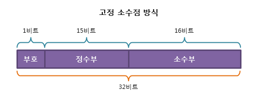

# 컴퓨터구조

## 컴퓨터의 구성

- __하드웨어__ : 컴퓨터를 구성하는 기계적 장치. 중앙처리장치, 기억장치, 입출력장치로 시스템 버스로 연결되어 구성된다. 
    * 중앙처리장치(CPU) : 주 기억 장치에서 프로그램 명령어와 데이터를 읽어와 처리하고 명령어의 수행 순서를 제어함. 중앙처리 장치는 비교와 연산을 담당하는 `산술논리연산장치(ALU)`와 명령어의 해석과 실행을 담당하는 `제어장치`, 속도가 빠른 데이터 기억장소인 `레지스터`로 구성되어 있음
    * 기억장치 : 프로그램, 데이터, 연산의 중간결과를 저장하는 장치. 주기억장치와 보조기억장치로 나뉘며 RAM과 ROM도 이곳에 해당함. 보조기억장치는 하드디스크 등의 속도는 느리지만 많은 자료를 영구적으로 보관할 수 있는 장치를 의미함.
    * 입출력장치 : 입력장치는 컴퓨터 내부로 자료를 입력하는 키보드, 마우스 등의 장치이며, 출력장치는 컴퓨터에서 외부로 자료를 표현하는 프린터 모니터 스피커 등의 장치이다.

ex) CPU, RAM, HDD, 마우스, 프린터

- __소프트웨어__ : 하드웨어의 동작을 지시하고 제어하는 명령어 집합
    * 시스템 소프트웨어 : 운영체제, 컴파일러
    * 응용 소프트웨어 : 워드프로세서, 스프레드 시트

### 시스템 버스 
: 하드웨어 구성 요소를 물리적으로 연결하는 선. 각 구성요소가 다른 구성요소로 데이터를 보낼 수 있도록 통로가 되어줌. 용도에 따라 데이터 버스, 주소 버스, 제어 버스로 나누어짐.

- 데이터 버스 : 중앙처리장치와 기타 장치 사이에서 데이터를 전달하는 통로. `양방향` 버스
- 주소 버스 : 중앙처리장치가 주기억장치나 입출력장치로 기억장치 주소를 전달하는 통로 `단방향` 버스
- 제어 버스 : 주소 버스와 데이터 버스는 모든 장치에 공유되기 때문에 이를 제어할 수단으로 제어 신호를 전달하는 통로. 기억장치 읽기 및 쓰기, 버스 요청 및 승인, 인터럽트 요청 및 승인, 클락, 리셋 등의 읽기 쓰기 동작을 모두 수행하는 `양방향` 버스

### 캐시 메모리
: 속도가 빠른 장치와 느린 장치에서 속도 차이에 따른 병목 현상을 줄이기 위한 메모리를 말한다. CPU가 주 기억장치에서 저장된 데이터를 읽어올 때 자주 사용하는 데이터를 캐시 메모리에서 먼저 가져오면서 속도를 향상시킨다. 

CPU는 이러한 캐시 메모리를 2~3개 정도 사용되며, 일반적으로 L1캐시부터 사용되며 점점 L3로 간다. 
- L1 : CPU 내부에 존재
- L2 : CPU와 RAM 사이에 존재
- L3 : 보통 메인보드에 존재

__작동원리__
- `시간지역성` : for나 while 같은 반복문에 사용하는 조건 변수 처럼 한번 참조된 데이터는 잠시 후 또 참조될 가능성이 높음.
- `공간지역성` : A[0], A[1]과 같은 연속 접근시 참조된 데이터 근처에 있는 데이터가 잠시 후 또 사용될 가능성이 높음. (참조지역성의 원리)

2가지 특징을 이용하여 조건에 알맞는 캐싱 전략을 적용함.

Cache Miss의 경우 3가지
1. Cold Miss : 해당 메모리 주소를 처음 불러서 나는 Miss
2. Conflict Miss : 캐시메모리에 A와 B 데이터를 저장해야 하는데, A와 B가 같은 캐시 메모리 주소에 할당되어 있어서 나는 Miss
3. Capacity miss : 캐시 메모리의 공간이 부족해서 나는 Miss

캐시크기를 키워서 문제를 해결하면 캐시 접근 속도가 느려지고 파워를 많이 먹는 단점이 생김.

### 고정 소수점 & 부동 소수점
: 컴퓨터에서 실수를 표현하는 방법에 `고정 소수점`과 `부동 소수점` 두가지 방식이 존재한다.

1. 고정 소수점 : 소수점이 찍힐 위치를 미리 정해 놓고 소수를 표현하는 방식

- 장점 : 실수를 정수부와 소수부로 표현하여 단순하다.
- 단점 : 표현의 범위가 너무 적어서 활용하기 힘들다. (정수부는 15bit, 소수부는 16bit)

2. 부동 소수점 : 지수의 값에 따라 소수점이 움직이는 방식을 활용한 실수 표현 방법.

- 장점 : 표현할 수 있는 수의 범위가 넓어진다.(현재 대부분 시스템에서 활용중)
- 단점 : 오차가 발생할 수 있다.(부동소수점으로 표현할 수 있는 방법이 매우 다양)

### 패리티 비트 & 해밍코드

__패리티 비트__

:정보 전달 과정에서 오류가 생겼는지 검사하기 위해 추가하는 비트를 말한다. 전송하고자 하는 데이터의 각 문자에 1 비트를 더하여 전송한다.

- 종류 : 짝수, 홀수
전체 비트에서 (짝수, 홀수에 맞도록 비트를 정하는 것)

> 짝수 패리티일 때 7 비트 데이터가 1010001이라면?
 11010001

 __해밍코드__

:데이터 전송시 1비트의 에러를 정정할 수 있는 자기 오류 정정 코드를 말한다.
패리티비트를 보고, 1 비트에 대한 오류를 정정할 곳을 찾아 수정할 수 있다. (패리티 비트는 오류를 검출하기만 할 뿐 수정하지는 않기 때문에 해밍 코드를 활용)

 방법
2의 n승 번째 자리인 1,2,4번째 자릿수가 패리티 비트라는 것으로 부터 시작한다. 이 숫자로부터 시작하는 세개의 패리티 비트가 짝수인지, 홀수인지 기준으로 판별한다.

> 짝수 패리티의 해밍 코드가 0011011일때 오류가 수정된 코드는?
1, 3, 5, 7번째 비트 확인 : 0101로 짝수이므로 '0'
2, 3, 6, 7번째 비트 확인 : 0111로 홀수이므로 '1'
4, 5, 6, 7번째 비트 확인 : 1011로 홀수이므로 '1'

역순으로 패리티비트 '110'을 도출했다. 10진법으로 바꾸면 '6'으로, 6번째 비트를 수정하면 된다.

따라서 정답은 00110'0'1이다.

### ARM 프로세서

프로세서란?
> 메모리에 저장된 명령어들을 실행하는 유한 상태 오토마톤

ARM : Advanced RISC Machine
즉, 진보된 RISC 기기의 약자로 ARM의 핵심은 RISC이다.

- __RISC__ : Reduced Instruction Set Computing (감소된 명령 집합 컴퓨팅)

단순한 명령 집합을 가진 프로세서가 복잡한 명령 집합을 가진 프로세서보다 훨씬 더 효율적이지 않을까?로 탄생함

- __CISC__ : Complecx instruction Set Computing (복잡한 명령 집합 컴퓨팅)
복잡한 명령 집합을 갖는 CPU 아키텍쳐. 명령어를 해석하는데 시간이 오래걸리며, 해석에 필요한 회로도 복잡하나. 풍부한 어드레싱 기능을 갖추고 있어. 명령의 직교성이 좋으며, 어느 어드레싱 모드에서도 임의의 연산을 수행할 수 있다. 

ARM 구조

ARM은 칩의 기본 설계 구조만 만들고, 실제 기능 추가와 최적화 부분은 개별 반도체 제조사의 영역으로 맡긴다. 따라서 물리적 설계는 같아도, 명령 집합이 모두 다르기 때문에 서로 다른 칩이 되기도 하는 것이 ARM.

소비자에게는 칩이 논리적 구조인 명령 집합으로 구성되면서, 이런 특성 때문에 물리적 설계 베이스는 같지만 용도에 따라 다양한 제품군을 만날 수 있는 특징이 있다.

아무래도 아키텍처는 논리적인 명령 집합을 물리적으로 표현한 것이므로, 명령어가 많고 복잡해질수록 실제 물리적인 칩 구조도 크고 복잡해진다.

하지만, ARM은 RISC 설계 기반으로 '단순한 명령집합을 가진 프로세서가 복잡한 것보다 효율적'임을 기반하기 때문에 명령 집합과 구조 자체가 단순하다. 따라서 ARM 기반 프로세서가 더 작고, 효율적이며 상대적으로 느린 것이다.

단순한 명령 집합은, 적은 수의 트랜지스터만 필요하므로 간결한 설계와 더 작은 크기를 가능케 한다. 반도체 기본 부품인 트랜지스터는 전원을 소비해 다이의 크기를 증가시키기 때문에 스마트폰이나 태블릿PC를 위한 프로세서에는 가능한 적은 트랜지스터를 가진 것이 이상적이다.

따라서, 명령 집합의 수가 적기 때문에 트랜지스터 수가 적고 이를 통해 크기가 작고 전원 소모가 낮은 ARM CPU가 스마트폰, 태블릿PC와 같은 모바일 기기에 많이 사용되고 있다.

ARM의 장점은?

소비자에 있어 ARM은 '생태계'의 하나라고 생각할 수 있다. ARM을 위해 개발된 프로그램은 오직 ARM 프로세서가 탑재된 기기에서만 실행할 수 있다. (즉, x86 CPU 프로세서 기반 프로그램에서는 ARM 기반 기기에서 실행할 수 없음)

따라서 ARM에서 실행되던 프로그램을 x86 프로세서에서 실행되도록 하려면 (혹은 그 반대로) 프로그램에 수정이 가해져야만 한다.

하지만, 하나의 ARM 기기에 동작하는 OS는 다른 ARM 기반 기기에서도 잘 동작한다. 이러한 장점 덕분에 수많은 버전의 안드로이드가 탄생하고 있으며 또한 HP나 블랙베리의 태블릿에도 안드로이드가 탑재될 수 있는 가능성이 생기게 된 것이다.

(하지만 애플사는 iOS 소스코드를 공개하지 않고 있기 때문에 애플 기기는 불가능하다)

ARM을 만드는 기업들은 통해 전력 소모를 줄이고 성능을 높이기 위해 설계를 개선하며 노력하고 있다.

애플 M1은 애플이 자사 매킨토시 컴퓨터용으로 설계한 최초의 ARM 기반 SoC이다. 
