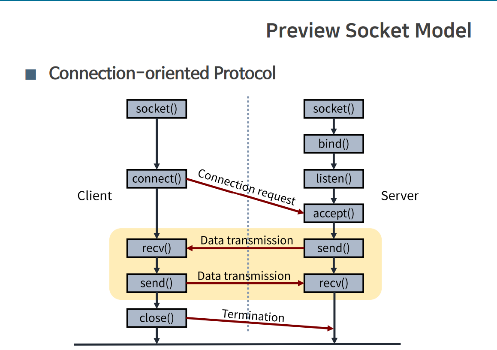
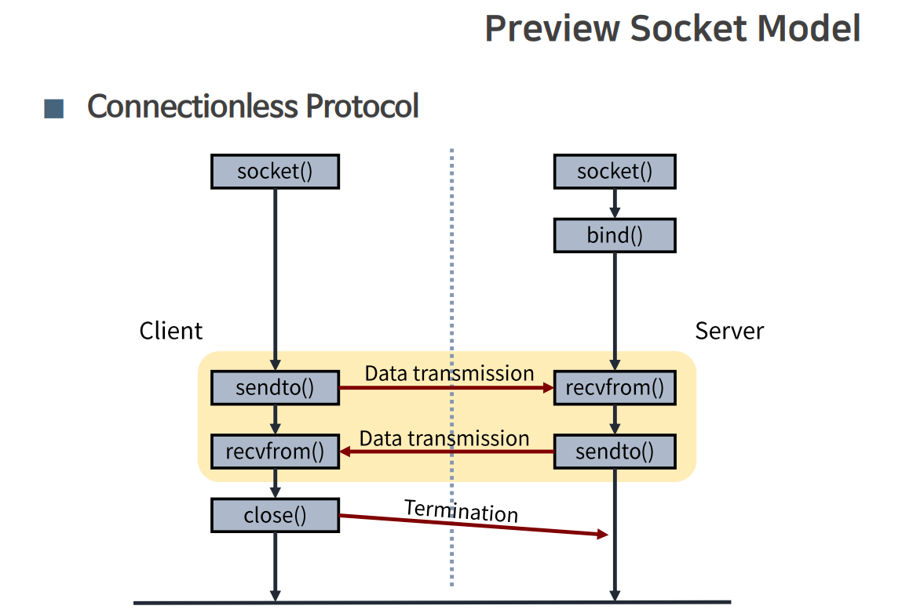
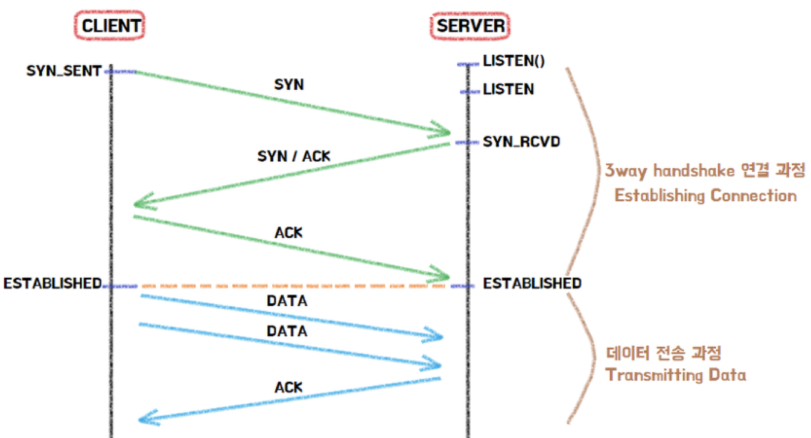
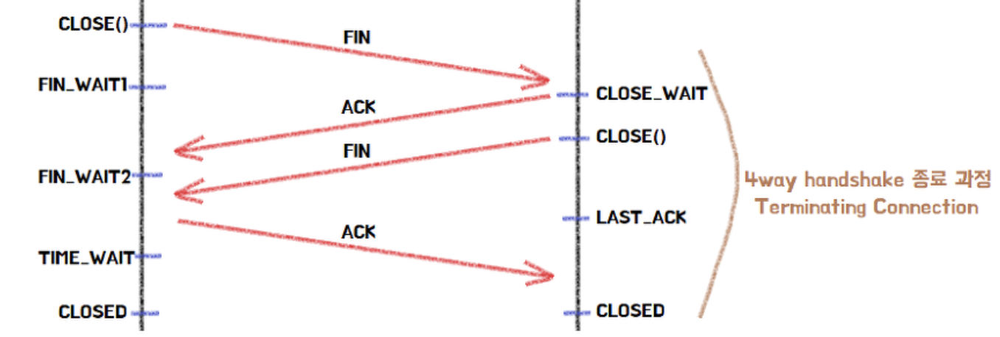
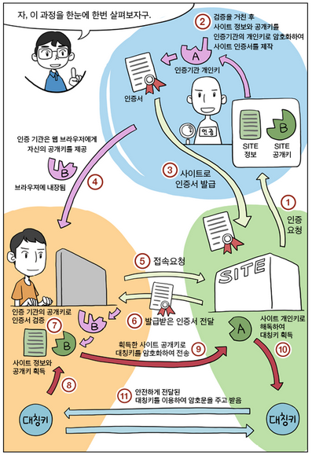

# NetWork

## OSI 7 계층
국제 표준 기구인 ISO에서 통신이 일어나는 과정을 7단계로 나눈 것.

### 7계층으로 나눈 이유

1.  __표준화__ 를 통해 이질적인 포트 문제나 프로토콜 등으로 인한 문제를 해결 하여 비용을 절감

2. 계층별로 기능과 통신 과정을 단계별로 나누어서 쉽게 알 수 있고, 특정한 곳에 이상이 생기면 그 단계만 수정할 수 있기 때문에 __해결하기 편리__ 하다.

###  각 계층별 설명

1. __물리계층(Physical)__ : 주로 전기적, 기계적, 기능적인 특성을 이용해서 `통신 케이블로 데이터를 전송하는 역할`
ex) 케이블, 리피터, 허브

2. __데이터링크계층(Data Link)__ : Physical Layer를 통해 송수신 되는 정보의 오류와 흐름을 관리하여 `안전한 정보 전달을 도와주는 역할.`
ex) Bridge, Switch

3. __네트워크 계층(Network)__ : 개방 시스템들 간의 `네트워크 연결을 관리`하는 기능과 `데이터의 교환 및 중계` 기능. 네트워크 연결을 설정, 유지, 해제하는 기능을 하며, 라우팅, 트래픽제어, 패킷 정보 전송을 수행.
ex) Router, IP

4. __전송 계층(Transport)__ : 최종 시스템 및 호스트간의 데이터 전송 연결 설정, 데이터 전송, 연결 해제 기능을 담당 / TCP, UDP 프로토콜을 통해 주소 설정, 다중화, 오류제어, 흐름제어를 수행
ex) TCP, UDP

5. __세션 계층(Session)__ : 양 끝단의 응용프로세스가 통신을 관리하기 위한 방법을 제공한다. __데이터를 통신하기 위한 논리적 연결을 담당__ 한다. TCP/IP 세션을 만들고 없애는 책임
ex) API, Socket

6. __표현 계층(Presentation)__ : 데이터 표현에 대한 __독립성을 제공__ 하고 __암호화__ 하는 역할을 담당한다. 코드간의 번역을 담당하여 사용자 시스템에서 데이터의 형식상 차이를 구분한다. 파일 인코딩, 명령어 포장, 압축, 암호화
ex) JPEG, MP4, PDF

7. __응용 계층(Application)__ : 최종 목적지로 __응용 프로세스와 직접 관계__ 하여 일반적인 응용 서비스를 사용자와 상호작용하여 수행한다. 사용자 인터페이스, 전자우편, 데이터베이스 관리 등의 서비스를 제공

ex) HTTP, DNS, FTP 등

> 데이터를 송신할 때는 상위 계층에서 하위 계층으로 data가 내려가면서 Header가 점점 더해져 encapsulation이 되고, 반대로 수신할 대는 하위계층에서 상위 계층으로 올라가면서 decapsulation이 되어 순수 데이터가 사용자에게 전달된다.
---

## TCP vs UDP

### TCP (Transfer Control Protocol)

- `신뢰성 있는 데이터 전송을 지원하는 연결 지향형의 프로토콜`이다.
- 일반적으로 TCP와 IP를 함께 사용하는데, IP가 데이터의 배달을 처리한다면, TCP는 패킷을 추적 및 관리한다. 
- 데이터의 전송순서를 보장하여, 흐름제어, 혼잡제어, 오류 제어를 통해 신뢰성을 보장한다. 그러나 이 때문에 UDP보다 전송 속도가 느리다는 단점이 있다.
- 연결을 설정하는 과정에는 3-way handshake 과정을 통해서 통신을 시작하고, 4-way handshake 과정을 통해 연결을 해제한다.
- 양단의 Data Stream을 열어 사이에서 TCP segments라고 불리는 패킷을 작게 분해하여 관리한다.
ex) HTTP, SMTP, FTP 

1. 흐름 제어 : 송신측과 수신측 사이의 데이터 처리 속도 차이를 해결하기 위한 기법.
- Stop and Wait : 전송한 패킷에 대한 확인 응답을 받으면 다음 패킷 전송
- Sliding Window : 윈도우 크기만큼 송신측에서 전송하여 데이터 흐름을 동적으로 조절하는 기법.

2. 오류 제어 : 오류 검출과 재전송을 포함. ARQ(Automatic Repeat reQuest) 기법을 사용해 재전송을 통해 오류를 복구한다.
- Stop and Wait ARQ : 오류 및 Timeout된  각 프레임을 재전송
- Go Back N ARQ(Sliding Window) : 확인된 마지막 프레임 이후로 모든 프레임을 재전송
- Selective-Reject ARQ : Go Back N 기법의 단점을 보완한 기법으로 손상, 손실된 프레임만 재전송한다. 별도의 데이터 재정렬을 수행해야 하기에 별도의 버퍼를 필요로 한다.

3. 혼잡 제어 : 송진측의 데이터 전달과 네트워크의 데이터 처리 속도를 해결하기 위한 기법. 네트워크의 혼잡을 피하기 위해 데이터의 전송 속도를 제어하는 법이다.
- AIMD(Additive Increase Multicative Decrease) : 전송한 패킷이 문제 없다면 Window Size를 1씩 증가시키고, 전송에 실패하거나 TIme out이 발생하면 Window Size를 절반으로 감소 시킨다.
- Slow Start : AIMD가 전송속도를 올리는 데 시간이 오래걸리는 단점을 보완. 전송한 패킷이 문제 없다면, Window Size를 2배로 증가시키고, 전송에 실패하거나 Time out이 발생하면 Window Size를 1로 떨어뜨린다. 한번 혼잡현상이 발생하고 나면 Window Size의 절반까지는 지수형태로 증가하다가 그 이후부터는 1씩 증가시키는 방식이다.

> 추가적인 정책들
> - 혼잡 회피 : 임계값 이후에는 윈도우 크기를 선형적으로 1씩 증가시키는 방법
> - 빠른 회복 : 혼잡한 상태가 되면 절반으로 줄이고 선형 증가 시키는 방법.
> - 빠른 재전송 : 흐름제어의 문제가 생긴경우 수신쪽에서 마지막으로 도착한 패킷의 ACK에 손실된 순번을 보낸다. 

### UDP (User Datagram Protocol)

- 비연결형 프로토콜로 `사전에 연결 설정 없이 각 데이터를 데이터 그램 단위로 처리하는 프로토콜`이다.
- 흐름제어, 혼잡 제어, 오류 제어를 하지 않으므로 손상된 세그먼트에 대한 재전송을 하지 않는다. 즉 TCP보다 빠른 속도를 제공하나, 신뢰성 있는 데이터 전송을 보장하지 못한다.
- RTP, Multicast, DNS 등에서 사용된다.
- 데이터를 보낼 때마다 address를 포함시켜서 보내야 한다.

---

### 3 way handshake (연걸)
: `TCP/IP 프로토콜을 이용하여 통신을 진행할 때, 두 종단 간 정확한 데이터 전송을 보장하기 위해 연결을 설정한 과정`.

</img>

[연결 과정]
1. 클라이언트는 서버에 접속을 요청하는 SYN(a) 패킷을 보낸다.
2. 서버는 클라이언트에 요청인 SYN(a)패킷에 대한 요청 수락응답으로 ACK(a+1) 패킷과 클라이언트도 포트를 열어달라는 SYN(b)패킷을 보낸다.
3. 클라이언트는 ACK(a+1)패킷과 SYN(b)에 대한 응답으로 ACK(b+1)패킷을 보내며, 연결이 성립된다.

> Q. 왜 2way가 아니라 3way일까?
TCP는 양방향성 연결이기 때문에 클라이언트에서 서버에게 자신의 존재를 알리고 패킷을 보낼 수 있는 것처럼 서버에서도 클라이언트에게 자신의 존재를 알리고 패킷을 보낼 수 있다는 신호를 보내야 하기 때문이다.

### 4 way handshake(연결 해제)
: `TCP/IP 프로토콜을 이용한 통신 과정에서 연결 설정을 해제하는 과정`

</img>

[해제 과정]
1. 클라이언트는 서버에게 연결을 종료하겠다는 FIN 패킷을 보낸다.
2. 서버는 클라이언트의 FIN에 대한 응답으로 ACK 패킷으 보낸다.
2-1.처리해야 할 자신의 통신이 끝날 대까지 기다린다. 
3. 처리해야할 모든 통신을 끝마쳤다면, 연결을 종료하겠다는 FIN 패킷을 서버에서 보낸다.
4. 클라이언트는 서버의 FIN 패킷에 대한 응답으로 ACK 패킷을 보낸다.
5. 클라이언트의 ACK 패킷을 받은 서버는 소켓 연결을 close한다.
6. 클라이언트는 아직 서버로부터 받지 못한 데이터가 있을 것을 대비해 기다리는 과정을 거친다. 

---
## REST
: REST란 REpresentational State Transfer의 약자로 웹의 장점을 최대한 활용할 수 있는 아키텍처이다
- URI를 통해 자원을 표시하고, HTTP Method를 이용하여 자원의 행위를 정해주며 그 결과를 받는 것을 말한다.

> GET : 정보를 요청하기 위해 사용
POST : 정보를 요청하기 위해 사용
PUT : 정보를 업데이트하기 위해 사용 (전체 업데이트)
PATCH : 정보를 업데이트하기 위해 사용 (일부 업데이트)
DELETE : 정보를 삭제하기 위해 사용 (DELETE)

__특징__
1. `유니폼 인터페이스` : HTTP 표준만 따른다면 어떤 플랫폼에 종속되지 않고 사용 가능한 인터페이스 스타일
2. `Stateless` : 각각의 요청을 완전히 다른 것으로 인식하고 처리
3. `Cachable` : HTTP가 가진 캐싱 기능 적용 가능
4. `자체 표현 구조(Self-Descriptiveness)` : API 메시지만 보고도 쉽게 이해할 수 있는 구조로 되어 있음
5. `Client-Server` : 자원이 있는 쪽이 Server 자원을 요청하는 쪽이 Client가 되어 서로 간의 의존성이 줄어들기 때문에 개발 해야할 내용이 명확해진다.
6. `계층화` : REST 서버가 다중 계층으로 구성될 수 있으면, 로드 밸런싱, 암호화, 사용자 인증등을 추가하여 유연성을 둘 수 있다. 

__RESTful API란 ?__
: REST 기반의 규칙들을 지켜서 설계된 API.

---
## HTTP - HTTPS

### HTTP (HyperText Transfer Protocol)
: 웹 서버와 클라이언트 간의 문서를 교환하기 위한 통신규약으로 TCP/IP기반으로 요청과 응답을 전송한다.
- Stateless한 구조는 Scaling이 자유롭다.

문제점
- HTTP는 평문 통신이기 때문에 도청이 가능하다.
- 통신상대를 확인하지 않기 때문에 위장이 가능하다.
- 완전성을 증명할 수 없기 때문에 변조가 가능하다.

### HTTPS(HTTP Secure)
: HTTP 통신하는 소켓 부분을 인터넷 상에서 정보를 암호화 하는 SSL(Secure Socket Layer) 프로토콜로 대체하여 대칭키 암호화 방식과 공개키 암호화 방식을 모두 사용한다.

### SSL
: Netscape 사에서 웹 서버와 브라우저 사이의 보안을 위해 만들어 졌으며, CA(Certificate Authority)라 불리는 서드 파티로 부터 서버와 클라이언트의 인증을 하는 데 사용된다.

[준비 과정]
1. 서버를 운영하는 기업은 HTTP 적용을 위한 공개키와 개인키를 만든다. 
2. 신뢰할 수 있는 CA기업을 선택하고 인증서 생성을 요청한다.
3. CA는 서버의 공개키, 암호화 방법 등의 정보를 담은 인증서를 만들고 해당 CA의 개인키로 암호화하여 서버에 제공한다.
4. 클라이언트가 SSL로 암호화된 페이지를 요청시 서버는 인증서를 전송한다.

[통신 과정]
1. 클라이언트가 SSL로 암호화된 페이지를 요청한다.
2. 서버는 클라이언트에게 인증서를 전송한다.
3. 클라이언트의 브라우저가 CA리스트와 해당 CA의 공개키를 가지고 있어, 해당 인증서가 CA에 의해 검토되어 데이터를 제공한 사람의 신원을 보장해주는 전자서명을 진행한다.
4. 클라이언트는 CA의 공개키를 이용해 인증서를 복호화하고 서버의 공개키를 획득한다.
5. 클라이언트는 서버의 공개키를 이용해 랜덤 대칭 암호화키, 데이터 등을 암호화 하여 서버로 전송한다.
6. 서버는 자신의 개인키를 이용해 복호화 하고 클라이언트의 랜덤대칭 암호화키, 데이터 등을 획득한다.
7. 서버는 랜덤 대칭 암호화 키로 클라이언트 요청에 대한 응답을 암호화 하여 전송한다.
8. 클라이언트는 랜덤 대칭 암호화키를 이용해 복호화 하고 데이터를 이용한다.

    

### Cookie vs Session
: HTTP는 stateless해서 상태정보를 유지하지 않는다. 쿠키와 세션을 통해서 이를 해결 할 수 있다.
||쿠키|세션|
|---|----|----|
|저장위치|브라우저가 지정하는 메모리|서버의 메모리|
|만료시점|expire 속성을 통해 지정|클라이언트가 로그아웃하거나 설정 시간동안 반응이 없는 경우|
|리소스|클라이언트의 메모리를 사용|서버 메모리로 로딩되기 때문에 세션이 생길 때마다 리소스를 차지|
|용량제한|한 도메인당 20개, 하나의 쿠키당 4KB|서버에 의해 생성되므로 개수나 용량 제한이 없다.|
|보안|클라이언트에 저장하기 때문에 보안에 취약하다|서버에 저장하기 때문에 쿠키에 비해서는 보안이 우수하다|